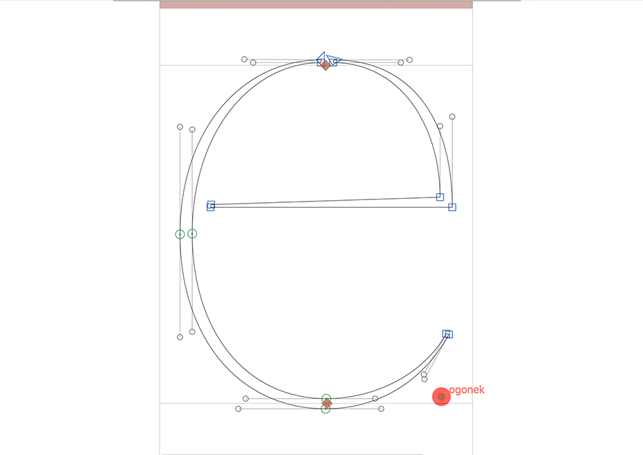

Show Anchors Compatibility
==============
This plugin is a complementary tool for Show Masters compatibility for those cases where the masters are not compatible because the abscense of wrong naming of an anchor.

The plugin displays a red circle behind the anchor that is not present in all masters.

### How to use:
Activate the plugin via **View>Show Anchors Compatibility** menu item.

### Donate
If this plugin is helpful for you, maybe you can consider making a donation ;)

